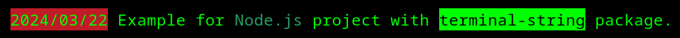

# Convenient syntax for adding color effects to text for the terminal

[](https://github.com/pi1igrim/terminal-string/blob/main/LICENSE)

## Description

When using the terminal, you can highlight text by changing the font color, background color, or assigning special effects.



The simple syntax makes it clear and convenient.

## Installation

``` bash
$ npm i terminal-string
```

## Usage

``` js
const Tstring = require('terminal-string');

const line = new Tstring()
  .bg.red('2024/03/22').reset(' ')
  .normal('Example for ')
  .bg.green().bright(' Node.js ').reset()
  .normal(' project with ')
  .reverse(' terminal-string ').reset()
  .normal(' package.')
  .toString();
console.log(line);
```

## Contributing

1. Fork it!
2. Create your feature branch: `git checkout -b my-new-feature`
3. Commit your changes: `git commit -am 'Add some feature'`
4. Push to the branch: `git push origin my-new-feature`
5. Submit a pull request :D

### Specification

* Text Effects
    * normal(): continue shows text without setting color effects;
    * reset(): clears all formatting. Sure that you call it at the end of using the terminal;
    * bright(): displays text with the bright effect;
    * dim(): displays text with the dim effect;
    * underscore(): display text with underscore;
    * blink(): displays text with the blink effect;
    * reverse(): changes background and foreground colors to opposite ones;
    * hidden(): displays text with the hidden effect;
* Foreground (text) colors
    * fg.black()
    * fg.red()
    * fg.green()
    * fg.yellow()
    * fg.blue()
    * fg.magenta()
    * fg.cyan()
    * fg.white()
    * fg.crimson()
* Background colors
    * bg.black()
    * bg.red()
    * bg.green()
    * bg.yellow()
    * bg.blue()
    * bg.magenta()
    * bg.cyan()
    * bg.white()
    * bg.crimson()

## History

* v1.0.0: Implemented the project.
* v1.1.0: Unnecessary packages has been removed. Added project and author links. Improved the documentation.

## License

[MIT](https://github.com/pi1igrim/terminal-string/blob/main/LICENSE)